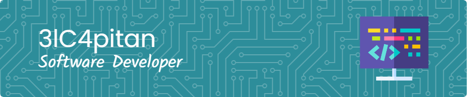

### Hi there 👋, my name is Amine
#### I am Software Developer

<!--div align="center">
  
</div-->

###

- 🔭 I’m currently working on this page.

###

  
  
  
  

###

  

###

  
  
  
  
  
  
  
  
  
  
  
  
  
  
  
  
  
  
  
  
  
  
  
  
  
  
  
  
  
  
  
  
  
  
  
  
  
  
  
  
  
  
  
  
  
  
  
  
  
  
  
  
  
  
  
  
  
  
  
  
  
  
  
  
  

###

###

  

###
